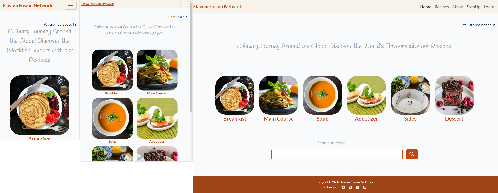
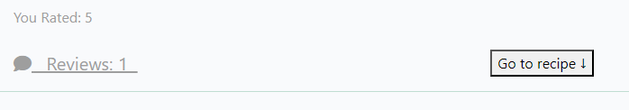
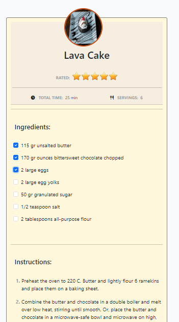
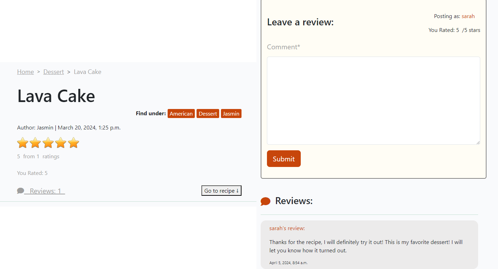
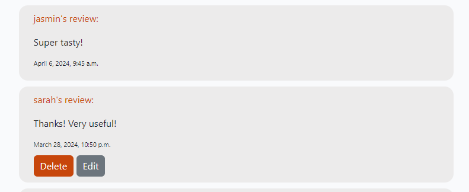
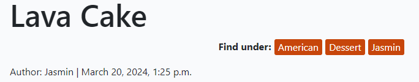
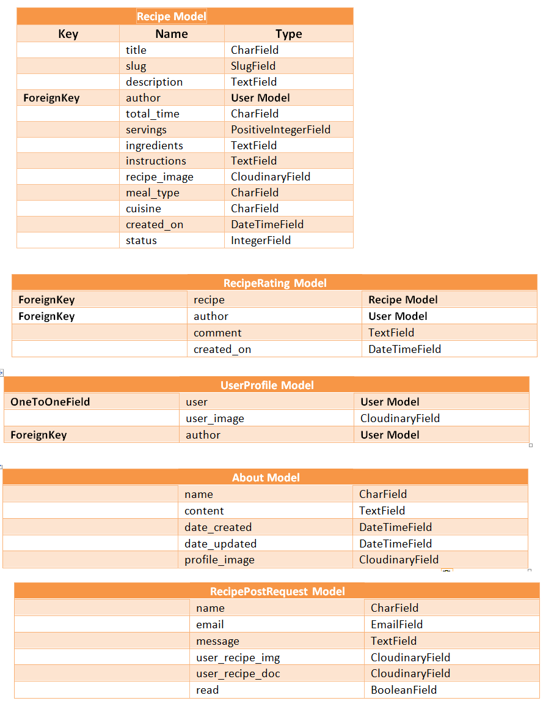
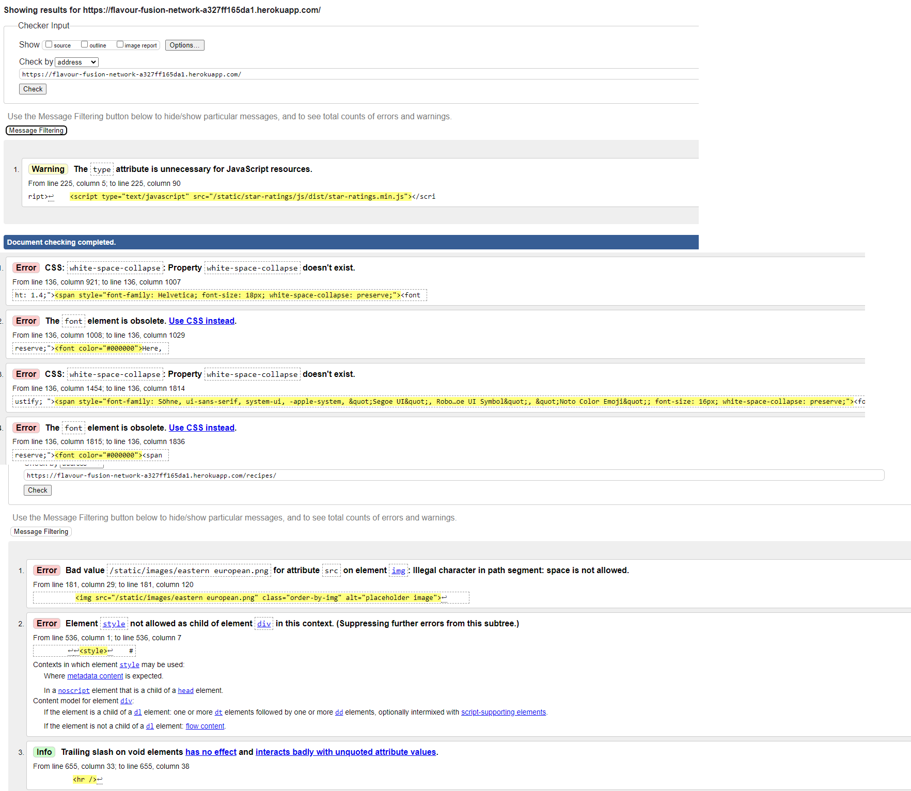
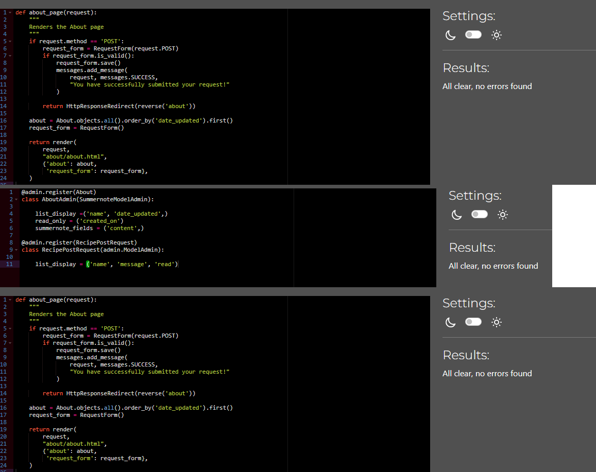
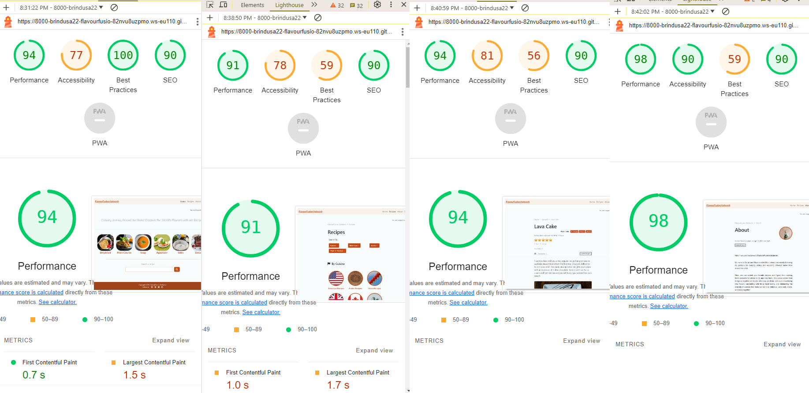

# FlavourFusion Network

[FlavourFusion Network](https://flavour-fusion-network-a327ff165da1.herokuapp.com/) is designed as an international culinary community that provides a platform for users to submit their favorite recipes,
which are then shared with the community for others to try and review. It is a pace where food brings people together, regardless of their 
background and location.

The live version of this project can be found [here](https://flavour-fusion-network-a327ff165da1.herokuapp.com/).

## How to use 

### Existing features

- The recipes are groupped by 3 categories: by mealtype, cuisine and author.
On the Homepage the user has two options: he can access the recipes groupped by mealtype or can use the searchbar. The search method is by the recipe name or any character contained by the recipe name. The results are displayed below the searchbar as clickable recipe cards.
- The Recipe page contains all the categories of recipes including the list of all recipes. The filter is represented by 4 clickable buttons that redirect the user to the respective section. When clicked, each category opens in a new page.
- Each recipe can be viewd in detail on a separate page. It containes detailed information about the recipe such as a short description a main picture and a recipe detail card with ingredients, that can be checked, instructions, total time, servings, ratings preview and a small image. If the user wants to skip directly to this part, there is a button at the top of the page for this.
    
   

    
    

- The recipe detail page has also a review system consisting of star ratings or comments. The user can leave a review or star rating only if he is logged in. The user can modify his star rating.

    

- If the user is logged in he can edit and modify or delete his comment

    

- Each recipe has tags displayed near its title, representing the categories under which the recipe can be found. When clicked they take the user to the page of that corresponding category, enabling thus the user to eassily find similar recipes. 

    

- The About page contains information about the owner and administrator of the page and a contact form where the user can submit his request.

### Future Features

- Implement sort by ratings/popularity
- Add profile image to the users in the review section
- Allow users to upload a recipe decument and images when subbiting a request 

## Database Models

## Testing

I have manually tested this project by checking all the forms and submitting various inputs and their outcomes in the admin page

### Validator Testing

- W3C Validator:

  

 - I have solved most of the errors that W3C Validator returned, with a few exceptions. For the Home page it returns no errors. However for the Recipe and the About page the errors refer to the style elemets errors, that were part of the paragraph styled with Summernote in the admin page. 

- PEP8:
    - No errors were returned from PEP8 Python Validator.

     

- Lighthouse report:

    

### Bugs
#### Solved Bugs

- After submitting the request form from the About page, each time the page was refreshed, the form was resubmitted. To solve that I have added HttpResponseRedirect to the about view to redirect the user to the about page after each posting.
- I encountered challenges in setting the user images to the Author category. I have created a new model in the recipes app, named UserProfile, with the imaged stored on Cloudinary, allowing the uploading and manipulation via the admin page. 
   - In the RecipeList view, which is a class-based view, I needed to retrieve data from the UserProfile model to access the Cloudinary images. To achieve this, I utilized the get_context_data method. Within this method, I retrieved data from the UserProfile model and added it to the context variable. This allowed me to pass the data to the template for rendering.
   - However, a problem was caused by the nested loops. I had to iterate through the query results from the UserProfile model, but I was already inside a for loop that was itetrating through a list of _authors_ to create the _Author_ category. This resulted in multiple instances of the same author being created for each user image.
   - The problem was solved adding an _author_ field to the UserProfile model, which served as a ForeignKey to the User model. Since _Author_ was already defined in the _get_context_data_ method, as the result of the User model query, there was no need to query the data again or to pass it to the context. Instead, I could directly access the image for each user through the _author_ context variable. This was also convenient because I was already inside the for loop so I didn't have to iterate through the query results again, so I was able to avoid iterating through the query results multiple times within nested loops.
- In the same view RecipeList, when retrieving the data from the Recipe model and filter it to get the values of the the meal _type field, it returned an object with the meal_type value of each of the recipes in the database. To solve this I have added the query results to a _set()_, which I have ordered alphabetically using the _sorted()_ method.
- The meal_type field from the Recipe model has a list of choices. It is defined at the top of the _recipes.models.py_ as as a list of tuples, assigned to a constant named _MEAL_TYPE_. When accessing the values of the meal_type field, I would always get the key, which was a problem for the main course choice, which has as a key main_course. In the Django template variable for the _breadcrumbs_ I was able to use _{{ recipe.get_meal_type_display }}_ to solve the problem. However, for the heading  _category title_ in the recipes_list template I was unable to do so, since it is a dynamically generated title with the context variable passed from the view of each category.  

#### Unsolved Bugs

- There are no major issues unsolved.

## Deployment

This project was deployed on Heroku:

- Steps to deployment:

    - Fork or clone this repository
    - Create a new Heroku app
    - Ensure the Django project has the proper requirements.txt and Procfile
    - In the Settings tab, set the Environment Variables
    - Navigate to Deploy tab
    - Connect the Heroku app to the repository
    - Choose the Main Branch for Deployment
    - Click on Deploy Branch
    - View the app

    The link to my deployed project:

    https://flavour-fusion-network-a327ff165da1.herokuapp.com/

## Credits

- The recipes were taken from [TheMealDB](https://www.themealdb.com/api.php), a free API for recipes:
    https://www.themealdb.com/api.php

- For the rating system I have installed and used _Django Star Ratings_ following the instructions found in the documentation:
    https://django-star-ratings.readthedocs.io/en/latest/index.html?highlight=static#usage

- I have found the templates for Star Ratings, which I have updated to use in my project on:
    https://github.com/wildfish/django-star-ratings

- The code to generate a unique slug was taken partially from:
    https://www.kodnito.com/posts/slugify-urls-django/

-  I have found all the relevant information in the Django documentation pages which was very useful:
    https://docs.djangoproject.com/en/4.2/ref/models/fields/#django.db.models.ImageField
    https://docs.djangoproject.com/en/1.11/ref/contrib/admin/#django.contrib.admin.ModelAdmin.readonly_fields